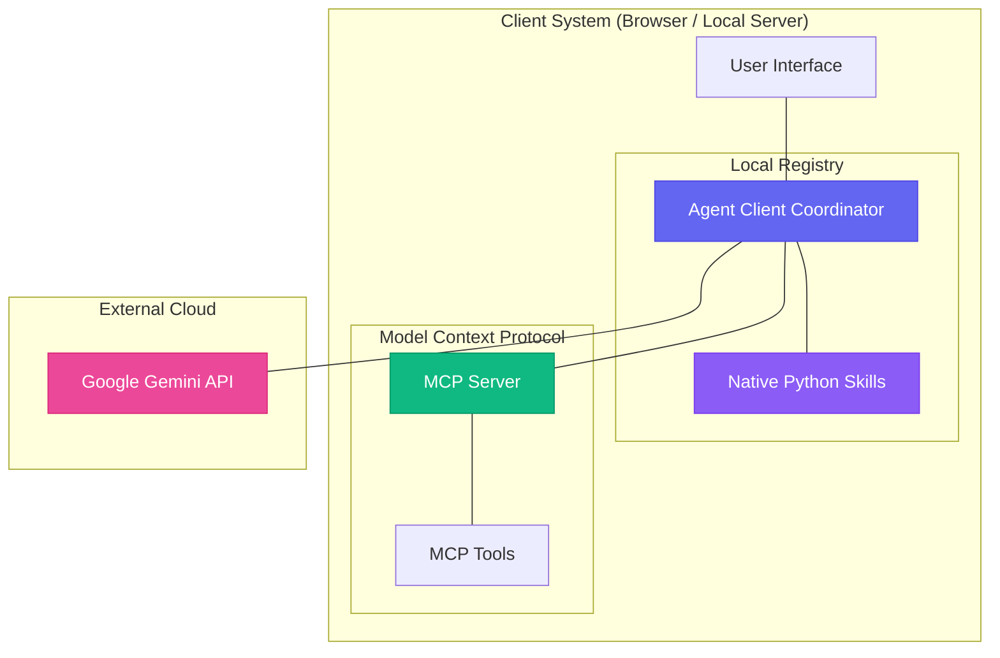

# AI Agent Skills & Model Context Protocol (MCP) Explorer

This repository contains a lightweight, educational **AI Agent Sandbox** built in raw Python (FastAPI) and Vanilla JavaScript. It demonstrates how AI agents dynamically reason, register custom skills, and execute tools locally.

To help you understand how all these pieces fit together, this document explains the relationships between **Agents, Skills, MCP Servers, MCP Tools, and Function Calling** with clear diagrams and step-by-step payloads.

---

## 1. Core Definitions & Relationships

To understand the system, we must distinguish between the orchestration layer, the capability definitions, and the communication protocols.

```
┌────────────────────────────────────────────────────────────────────────┐
│                              AI AGENT                                  │
│  Orchestrator: System Prompt, Memory, Reasoning Loop, LLM Coordinator  │
└───────────────────────────────────┬────────────────────────────────────┘
                                    │ Coordinates / Orchestrates
┌───────────────────────────────────▼────────────────────────────────────┐
│                    SKILLS / TOOLS REGISTRY                             │
│  Internal list of capabilities. Maps code functions to JSON Schemas.  │
└───────────────────┬────────────────────────────────┬───────────────────┘
                    │                                │
      Exposed natively via                           │ Hosted / Exchanged via
      Python Decorators / JS APIs                    │ Standard Protocol (MCP)
┌───────────────────▼───────────────────┐    ┌───────▼───────────────────┐
│            NATIVE SKILLS              │    │        MCP SERVER         │
│  e.g. calculator(), get_weather()     │    │  Wrapper hosting tools    │
│  Defined locally in client app.       │    │  over SSE / stdio line.   │
└───────────────────────────────────────┘    └───────┬───────────────────┘
                                                     │ Exposes
                                             ┌───────▼───────────────────┐
                                             │         MCP TOOLS         │
                                             │  Schemas + exec hooks     │
                                             └───────────────────────────┘
```

*   **AI Agent**: The coordinator. It doesn't perform calculations or API fetches natively. Instead, it manages the **System Prompt** (rules of engagement), **Conversational Memory** (chat history), and the **Reasoning Loop** (Thought ➔ Action ➔ Observation).
*   **Skills (Tools)**: Individual, isolated Python functions or JavaScript operations that perform a single concrete task (e.g. evaluating a math string, reading a database, fetching web page text).
*   **Function Calling**: The *communication protocol* used between the Agent and the Large Language Model (LLM). Instead of parsing messy text output, the LLM outputs a structured JSON block requesting a tool execution, and the Agent responds with a structured JSON observation.
*   **Model Context Protocol (MCP)**: An open-standard protocol (designed by Anthropic) that standardizes how AI applications connect to data sources and tools.
*   **MCP Server**: An independent process (running locally or remotely) that hosts a list of tools. Rather than coding custom integrations for every tool, the agent connects to the MCP Server using a standard transport (SSE or stdio) to fetch tool schemas and request tool execution.
*   **MCP Tools**: The specific schemas and functions exposed *by* an MCP server to client applications.

---

## 1.5. Demystifying: Skills vs. Tools vs. Function Calling

It is common to get confused by these terms because they are often used interchangeably in AI development, but they have distinct technical roles in the lifecycle of an agent execution loop.

### Translation Glossary

| Term | What it is | Real-World Analogy | File / Location in this Project |
| :--- | :--- | :--- | :--- |
| **Skill** | The actual Python code that does the work. | A physical tool in your toolbox (e.g., a screwdriver). | [`skills.py`](file:///Users/donthireddy/code/agentic/skills.py) (e.g., `def calculator(...)`) |
| **Tool Schema** | The JSON metadata describing the function name, arguments, and description. | A catalog description explaining what the screwdriver does and what screws it fits. | Auto-generated by `@skill` decorator and returned by `GET /api/tools` |
| **Function Call** | A JSON message returned by the LLM requesting the execution of a tool. | An instruction manual telling you: *"Pick up the screwdriver and turn screw 'X' 5 times."* | Returned by Gemini API as `functionCall` in the response payload. |

### The Relationship Chain: Step-by-Step

1.  **You write a Skill (Python Function)**:
    You write a local Python function like `calculator()`. It is code residing on your machine.
2.  **The Backend Extracts the Tool Schema (Declaration)**:
    The backend inspects the function parameters and docstring to generate a **Tool Schema** in JSON format. This schema is a declaration that says: *"There exists a tool named 'calculator' that takes a parameter named 'expression' (which must be a string)."* This is what is returned when you query `GET /api/tools`.
3.  **The Agent sends Tool Schemas to the LLM**:
    The agent sends your query along with the list of **Tool Schemas** to the LLM (Gemini) via a HTTP `POST` request. This tells the LLM: *"Here is the user query. I also have a list of tools I can execute for you if you need them."*
4.  **The LLM triggers a Function Call**:
    The LLM reads your query, references the tool schemas, and decides: *"To solve this, I need to evaluate '18 * 18'. I will output a function call for the 'calculator' tool with the argument expression='18.0 * 18.0'."* The LLM outputs a **Function Call** (`functionCall`) object in JSON.
5.  **The Agent executes the Skill**:
    The Agent receives the `functionCall` request, maps the name `"calculator"` to the local **Skill** (`calculator()` function), runs it, and grabs the return value (`324.0`).
6.  **The Agent returns the Observation**:
    The Agent packages the result into a tool response and feeds it back to the LLM, completing the turn.

---


## 2. System Architecture

The following diagram shows where the components sit. Notice that **no agent frameworks** (like LangChain) are required; the Agent Client coordinates directly with the LLM via HTTP and runs local/MCP tools directly.



---

## 3. Step-by-Step Execution Sequence

Here is the chronological sequence of events when a user submits a query that requires executing local tools.

```mermaid
sequenceDiagram
    autonumber
    actor User as Developer (Browser)
    participant Agent as Agent Client (Python/JS)
    participant MCP as MCP Server / Skills Registry
    participant LLM as Gemini API (LLM)

    User->>Agent: Submit Query: "Get Tokyo weather & square it"
    
    rect rgb(20, 25, 45)
        Note over Agent,MCP: 1. Tool Declaration Phase
        Agent->>MCP: GET /api/skills
        MCP-->>Agent: Returns JSON Schemas: get_weather(city), calculator(expression), browser_storage(...)
    end
    
    rect rgb(30, 20, 40)
        Note over Agent,LLM: 2. LLM Planning Phase (Turn 1)
        Agent->>LLM: POST /v1beta/models/gemini-2.5-flash:generateContent (Prompt + Tool Schemas)
        Note over LLM: LLM Decides:<br/>Call get_weather(city="Tokyo")
        LLM-->>Agent: JSON Response: functionCall { name: "get_weather", args: { city: "Tokyo" } }
    end
    
    rect rgb(20, 40, 30)
        Note over Agent,MCP: 3. Execution Phase (Turn 1)
        Agent->>Agent: Map "get_weather" -> skills.py:get_weather(city="Tokyo")
        Agent->>MCP: Call local Python: get_weather(city="Tokyo")
        MCP-->>Agent: Returns string: "Weather in Tokyo: 18°C, Rainy, Humidity: 85%."
    end
    
    rect rgb(30, 20, 40)
        Note over Agent,LLM: 4. LLM Planning Phase (Turn 2)
        Agent->>LLM: POST (Prompt + functionCall + functionResponse: "18°C, Rainy")
        Note over LLM: LLM Decides:<br/>Call calculator(expression="18.0 * 18.0")
        LLM-->>Agent: JSON Response: functionCall { name: "calculator", args: { expression: "18.0 * 18.0" } }
    end
    
    rect rgb(20, 40, 30)
        Note over Agent,MCP: 5. Execution Phase (Turn 2)
        Agent->>Agent: Map "calculator" -> skills.py:calculator(expression="18.0 * 18.0")
        Agent->>MCP: Call local Python: calculator(expression="18.0 * 18.0")
        MCP-->>Agent: Returns float: 324.0
    end
    
    rect rgb(30, 20, 40)
        Note over Agent,LLM: 6. Finalization Phase
        Agent->>LLM: POST (Prompt + get_weather result + calculator result: 324.0)
        Note over LLM: LLM Decides:<br/>All tools completed, synthesize final answer
        LLM-->>Agent: JSON Response: text: "The weather in Tokyo is currently 18.0°C. Squaring it gives 324.0."
    end
    
    Agent-->>User: SSE Stream chunk: {"type": "final_answer", "content": "The weather..."}
```



---

## 4. Under the Hood: Payload Specifications

Let's look at the exact JSON packages exchanged in the steps above using standard Google Gemini API models.

### Step 1: Declaring available tools to the LLM (API Request)
The Agent sends the system prompt, user query, and a list of tool definitions under the `tools` array.

```json
{
  "contents": [
    {
      "role": "user",
      "parts": [{"text": "What is the weather in Tokyo and what is that squared?"}]
    }
  ],
  "systemInstruction": {
    "parts": [{"text": "You are an AI Agent. Use tools to query values."}]
  },
  "tools": [
    {
      "functionDeclarations": [
        {
          "name": "get_weather",
          "description": "Fetches the current weather report for a given city.",
          "parameters": {
            "type": "OBJECT",
            "properties": {
              "city": {
                "type": "STRING",
                "description": "The name of the city."
              }
            },
            "required": ["city"]
          }
        },
        {
          "name": "calculator",
          "description": "Evaluates a mathematical expression safely.",
          "parameters": {
            "type": "OBJECT",
            "properties": {
              "expression": {
                "type": "STRING",
                "description": "The math expression to evaluate."
              }
            },
            "required": ["expression"]
          }
        }
      ]
    }
  ]
}
```

### Step 2: The LLM issues a Tool Call (API Response)
Gemini evaluates the schemas, realizes it needs Tokyo's weather, and returns a `functionCall` part rather than conversational text.

```json
{
  "candidates": [
    {
      "content": {
        "role": "model",
        "parts": [
          {
            "text": "Thought: I need to query Tokyo's current weather first."
          },
          {
            "functionCall": {
              "name": "get_weather",
              "args": {
                "city": "Tokyo"
              }
            }
          }
        ]
      }
    }
  ]
}
```

### Step 3: Feeding back the Observation (Next API Request)
The Agent executes `get_weather(city="Tokyo")` locally, receives `"Weather in Tokyo: 18°C, Rainy."`, and appends two roles to the history:
1.  The model's original `functionCall` request.
2.  A new `tool` role containing the matching `functionResponse`.

```json
{
  "contents": [
    {
      "role": "user",
      "parts": [{"text": "What is the weather in Tokyo and what is that squared?"}]
    },
    {
      "role": "model",
      "parts": [
        { "text": "Thought: I need to query Tokyo's current weather first." },
        { "functionCall": { "name": "get_weather", "args": { "city": "Tokyo" } } }
      ]
    },
    {
      "role": "tool",
      "parts": [
        {
          "functionResponse": {
            "name": "get_weather",
            "response": {
              "output": "Weather in Tokyo: 18°C, Rainy, Humidity: 85%."
            }
          }
        }
      ]
    }
  ],
  "tools": [...]
}
```

This sequence repeats for the `calculator` tool, until the LLM returns a text response containing no `functionCall` instructions, completing the loop.

---

## 5. Concrete Code Integration Example

Here is a full end-to-end look at how a single skill travels through this system:

### 1. The Developer writes standard Python code:
You define a Python function with docstrings and type hints, decorating it with `@skill`:
```python
@skill
def calculate_cube(n: float) -> float:
    """
    Calculates the cube of a number (n multiplied by itself three times).
    
    Args:
        n: The base number to cube.
    """
    return n * n * n
```

### 2. The Registry compiles it into an LLM Declaration schema:
Under the hood, Python standard reflection inspects `calculate_cube` and produces this schema:
```json
{
  "name": "calculate_cube",
  "description": "Calculates the cube of a number (n multiplied by itself three times).",
  "parameters": {
    "type": "OBJECT",
    "properties": {
      "n": {
        "type": "NUMBER",
        "description": "The base number to cube."
      }
    },
    "required": ["n"]
  }
}
```

### 3. The LLM requests to call it:
If the user asks: *"What is 5 cubed?"*, the LLM reads the schema and responds:
```json
{
  "functionCall": {
    "name": "calculate_cube",
    "args": {
      "n": 5.0
    }
  }
}
```

### 4. The Agent routes the call back to your local code:
The Agent Client intercepts the request, maps the `name` `"calculate_cube"` to your Python function, and executes it:
```python
# The Agent retrieves the function reference and maps the LLM arguments
func = registry.skills["calculate_cube"]["func"]  # calculate_cube
args = {"n": 5.0}

# Executes the code locally
result = func(**args)  # Returns 125.0
```

The resulting `125.0` is sent back to the LLM, which writes: *"5 cubed is 125."*

