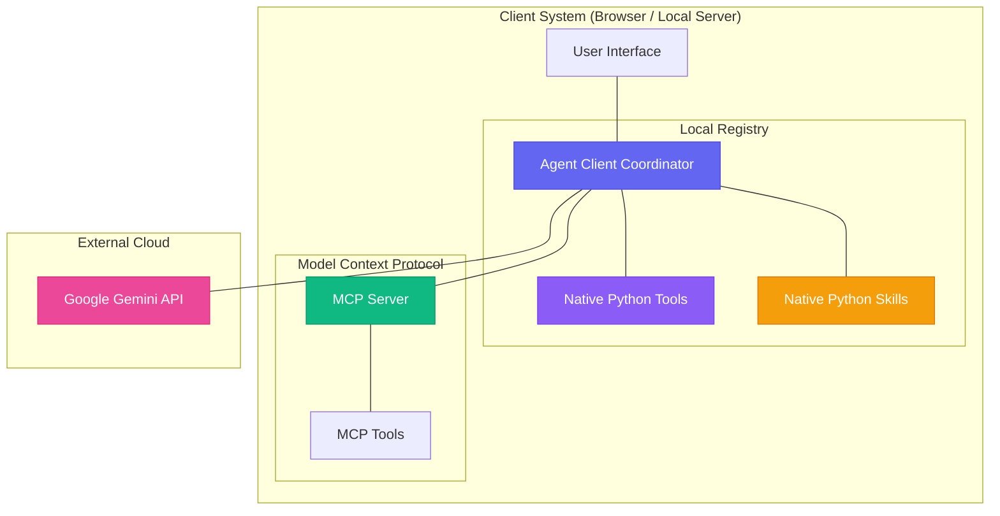

# AI Agent Skills & Model Context Protocol (MCP) Explorer

This repository contains a lightweight, educational **AI Agent Sandbox** built in raw Python (FastAPI) and Vanilla JavaScript. It demonstrates how AI agents dynamically reason, register custom skills, and execute tools locally.

To help you understand how all these pieces fit together, this document explains the relationships between **Agents, Skills, MCP Servers, MCP Tools, and Function Calling** with clear diagrams and step-by-step payloads.

---

## 1. Core Definitions & Relationships

To understand the system, we must distinguish between the orchestration layer, the capability definitions, and the communication protocols.

```
┌────────────────────────────────────────────────────────────────────────┐
│                              AI AGENT                                  │
│  Orchestrator: System Prompt, Memory, Reasoning Loop, LLM Coordinator  │
└───────────────────────────────────┬────────────────────────────────────┘
                                    │ Coordinates / Orchestrates
┌───────────────────────────────────▼────────────────────────────────────┐
│                    SKILLS / TOOLS REGISTRY                             │
│  Internal list of capabilities. Maps code functions to JSON Schemas.  │
└───────────────────┬────────────────────────────────┬───────────────────┘
                    │                                │
      Exposed natively via                           │ Hosted / Exchanged via
      Python Decorators / JS APIs                    │ Standard Protocol (MCP)
┌───────────────────▼───────────────────┐    ┌───────▼───────────────────┐
│        NATIVE TOOLS & SKILLS          │    │        MCP SERVER         │
│  e.g. calculator(), research_city()   │    │  Wrapper hosting tools    │
│  Defined locally in client app.       │    │  over SSE / stdio line.   │
└───────────────────────────────────────┘    └───────┬───────────────────┘
                                                     │ Exposes
                                             ┌───────▼───────────────────┐
                                             │         MCP TOOLS         │
                                             │  Schemas + exec hooks     │
                                             └───────────────────────────┘
```

*   **AI Agent**: The coordinator. It doesn't perform calculations or API fetches natively. Instead, it manages the **System Prompt** (rules of engagement), **Conversational Memory** (chat history), and the **Reasoning Loop** (Thought ➔ Action ➔ Observation).
*   **Tools**: Low-level, atomic Python functions or JavaScript operations that perform a single concrete task (e.g. evaluating a math string, fetching current weather).
*   **Skills**: High-level, composite Python workflows that coordinate multiple tools locally under a single entry point (e.g. performing city research by fetching weather, running conversions, fetching wikipedia, and saving results).
*   **Function Calling**: The *communication protocol* used between the Agent and the Large Language Model (LLM). Instead of parsing messy text output, the LLM outputs a structured JSON block requesting a tool or skill execution, and the Agent responds with a structured JSON observation.
*   **Model Context Protocol (MCP)**: An open-standard protocol (designed by Anthropic) that standardizes how AI applications connect to data sources and tools.
*   **MCP Server**: An independent process (running locally or remotely) that hosts a list of tools. Rather than coding custom integrations for every tool, the agent connects to the MCP Server using a standard transport (SSE or stdio) to fetch tool schemas and request tool execution.
*   **MCP Tools**: The specific schemas and functions exposed *by* an MCP server to client applications.

---

## 1.5. Demystifying: Skills vs. Tools vs. Function Calling

In this codebase and in the broader AI agent ecosystem, these terms serve distinct technical purposes. Here is the breakdown:

### Translation Glossary

| Term | What it is | Real-World Analogy | File / Location in this Project |
| :--- | :--- | :--- | :--- |
| **Tool (Atomic)** | A low-level, technical capability—usually a single function or API call. Performs a single, simple task. | A single hand tool (e.g., a screwdriver or a thermometer). | [`tools.py`](file:///Users/donthireddy/code/agentic/tools.py) (e.g. `calculator`, `get_weather`) |
| **Skill (Composite)** | A high-level, goal-oriented workflow. Coordinates multiple tools and logic *locally in Python*. | A complex assembly machine or automated robot that knows how to use multiple tools to build a product. | [`skills.py`](file:///Users/donthireddy/code/agentic/skills.py) (e.g. `research_city`) |
| **Tool/Skill Schema** | The JSON metadata describing the function name, arguments, and docstrings. | A catalog sheet showing the inputs, outputs, and description of the tool/skill. | Auto-generated by decorators and fetched via `GET /api/tools` or `GET /api/skills` |
| **Function Call** | A JSON response from the LLM requesting the execution of a registered Tool or Skill. | An instruction manual telling you: *"Run tool X with arguments Y."* | Returned by Gemini API as `functionCall` in the response payload. |

### The Relationship Chain: Step-by-Step

1. **You define Tools and Skills**:
   You write Python code for atomic functions in `tools.py` (decorated with `@tool`) and composite workflows in `skills.py` (decorated with `@skill`).
2. **The Backend Extracts Schemas (Declarations)**:
   The backend inspects your Python code (parameters and docstrings) using introspection to auto-generate JSON schemas representing their input interfaces.
3. **The Agent sends Schemas to the LLM**:
   The agent bundles the schemas from both registries and sends them alongside your prompt in a POST request.
4. **The LLM triggers a Function Call**:
   The LLM reads the request. If it decides to execute a high-level composite skill (like `research_city`), it issues a single function call for that skill.
5. **The Agent executes the Skill**:
   The Agent Client intercepts the request, runs the python function `research_city()` locally, which executes multiple low-level tools (weather, math, storage) internally inside Python.
6. **The Agent returns the Observation**:
   The final report created by the skill is sent back to the LLM as a single tool response.

## 2. System Architecture

The following diagram shows where the components sit. Notice that **no agent frameworks** (like LangChain) are required; the Agent Client coordinates directly with the LLM via HTTP and runs local Tools and Skills directly.



---

## 3. Step-by-Step Execution Sequence

Depending on whether the LLM chooses low-level **Tools** or high-level **Skills**, the execution sequence and coordination path differs significantly.

### Flow A: Low-level Atomic Tools (Sequential Loop)
*For query: "Get Tokyo weather & square it"* (Requires multiple planning cycles as the LLM sequences the tools).

```mermaid
sequenceDiagram
    autonumber
    actor User as Developer (Browser)
    participant Agent as Agent Client (Python/JS)
    participant Registry as Tools Registry (tools.py)
    participant LLM as Gemini API (LLM)

    User->>Agent: Submit Query: "Get Tokyo weather & square it"
    
    rect rgb(20, 25, 45)
        Note over Agent,Registry: 1. Tool Declaration Phase
        Agent->>Registry: GET /api/tools
        Registry-->>Agent: Returns JSON Schemas: get_weather(city), calculator(expression), browser_storage(...)
    end
    
    rect rgb(30, 20, 40)
        Note over Agent,LLM: 2. LLM Planning Phase (Turn 1)
        Agent->>LLM: POST /v1beta/... (Prompt + Tool Schemas)
        Note over LLM: LLM Decides:<br/>Call get_weather(city="Tokyo")
        LLM-->>Agent: JSON Response: functionCall { name: "get_weather", args: { city: "Tokyo" } }
    end
    
    rect rgb(20, 40, 30)
        Note over Agent,Registry: 3. Execution Phase (Turn 1)
        Agent->>Agent: Map "get_weather" -> tools.py:get_weather(city="Tokyo")
        Agent->>Registry: Call local Python: get_weather(city="Tokyo")
        Registry-->>Agent: Returns string: "Weather in Tokyo: 18°C, Rainy..."
    end
    
    rect rgb(30, 20, 40)
        Note over Agent,LLM: 4. LLM Planning Phase (Turn 2)
        Agent->>LLM: POST (Prompt + weather result)
        Note over LLM: LLM Decides:<br/>Call calculator(expression="18.0 * 18.0")
        LLM-->>Agent: JSON Response: functionCall { name: "calculator", args: { expression: "18.0 * 18.0" } }
    end
    
    rect rgb(20, 40, 30)
        Note over Agent,Registry: 5. Execution Phase (Turn 2)
        Agent->>Agent: Map "calculator" -> tools.py:calculator(expression="18.0 * 18.0")
        Agent->>Registry: Call local Python: calculator(expression="18.0 * 18.0")
        Registry-->>Agent: Returns float: 324.0
    end
    
    rect rgb(30, 20, 40)
        Note over Agent,LLM: 6. Finalization Phase
        Agent->>LLM: POST (Prompt + weather result + calculator result: 324.0)
        Note over LLM: LLM Decides:<br/>All tools completed, synthesize final answer
        LLM-->>Agent: JSON Response: text: "The weather in Tokyo is currently 18.0°C. Squaring it gives 324.0."
    end
    
    Agent-->>User: SSE Stream chunk: {"type": "final_answer", "content": "The weather..."}
```



---

### Flow B: High-level Composite Skills (Encapsulated execution)
*For query: "Run a full travel research report on Paris"* (Saves LLM planning turns by executing the entire workflow locally in Python).

```mermaid
sequenceDiagram
    autonumber
    actor User as Developer (Browser)
    participant Agent as Agent Client (Python/JS)
    participant SkillsReg as Skills Registry (skills.py)
    participant ToolsReg as Tools Registry (tools.py)
    participant LLM as Gemini API (LLM)

    User->>Agent: Submit Query: "Run a full travel research report on Paris"
    
    rect rgb(20, 25, 45)
        Note over Agent,SkillsReg: 1. Capability Declaration Phase
        Agent->>SkillsReg: GET /api/tools & GET /api/skills
        SkillsReg-->>Agent: Returns tool + skill schemas (including research_city)
    end
    
    rect rgb(30, 20, 40)
        Note over Agent,LLM: 2. LLM Planning Phase (Turn 1)
        Agent->>LLM: POST /v1beta/... (Prompt + Tool/Skill Schemas)
        Note over LLM: LLM Decides:<br/>Call research_city(city="Paris")
        LLM-->>Agent: JSON Response: functionCall { name: "research_city", args: { city: "Paris" } }
    end
    
    rect rgb(20, 40, 30)
        Note over Agent,ToolsReg: 3. Local Workflow Execution Phase (1 Turn on LLM side!)
        Agent->>SkillsReg: Call local Python: research_city(city="Paris")
        Note over SkillsReg: research_city starts...
        SkillsReg->>ToolsReg: Call get_weather(city="Paris") -> "16°C, Windy"
        SkillsReg->>ToolsReg: Call calculator("(16 * 9/5) + 32") -> 60.8
        SkillsReg->>ToolsReg: Call fetch_webpage("https://en.wikipedia.org/wiki/Paris") -> Wiki text
        SkillsReg->>ToolsReg: Call browser_storage("SET", "paris_travel_report", report) -> Success
        SkillsReg-->>Agent: Returns full multi-line report
    end
    
    rect rgb(30, 20, 40)
        Note over Agent,LLM: 4. Finalization Phase
        Agent->>LLM: POST (Prompt + research_city response)
        Note over LLM: LLM Decides:<br/>Work completed, summarize report details
        LLM-->>Agent: JSON Response: text: "I have successfully run and saved the travel report..."
    end
    
    Agent-->>User: SSE Stream chunk: {"type": "final_answer", "content": "I have successfully..."}
```



---

## 4. Under the Hood: Payload Specifications

Let's look at the exact JSON packages exchanged in the steps above using standard Google Gemini API models.

### Step 1: Declaring available tools to the LLM (API Request)
The Agent sends the system prompt, user query, and a list of tool definitions under the `tools` array.

```json
{
  "contents": [
    {
      "role": "user",
      "parts": [{"text": "What is the weather in Tokyo and what is that squared?"}]
    }
  ],
  "systemInstruction": {
    "parts": [{"text": "You are an AI Agent. Use tools to query values."}]
  },
  "tools": [
    {
      "functionDeclarations": [
        {
          "name": "get_weather",
          "description": "Fetches the current weather report for a given city.",
          "parameters": {
            "type": "OBJECT",
            "properties": {
              "city": {
                "type": "STRING",
                "description": "The name of the city."
              }
            },
            "required": ["city"]
          }
        },
        {
          "name": "calculator",
          "description": "Evaluates a mathematical expression safely.",
          "parameters": {
            "type": "OBJECT",
            "properties": {
              "expression": {
                "type": "STRING",
                "description": "The math expression to evaluate."
              }
            },
            "required": ["expression"]
          }
        }
      ]
    }
  ]
}
```

### Step 2: The LLM issues a Tool Call (API Response)
Gemini evaluates the schemas, realizes it needs Tokyo's weather, and returns a `functionCall` part rather than conversational text.

```json
{
  "candidates": [
    {
      "content": {
        "role": "model",
        "parts": [
          {
            "text": "Thought: I need to query Tokyo's current weather first."
          },
          {
            "functionCall": {
              "name": "get_weather",
              "args": {
                "city": "Tokyo"
              }
            }
          }
        ]
      }
    }
  ]
}
```

### Step 3: Feeding back the Observation (Next API Request)
The Agent executes `get_weather(city="Tokyo")` locally, receives `"Weather in Tokyo: 18°C, Rainy."`, and appends two roles to the history:
1.  The model's original `functionCall` request.
2.  A new `tool` role containing the matching `functionResponse`.

```json
{
  "contents": [
    {
      "role": "user",
      "parts": [{"text": "What is the weather in Tokyo and what is that squared?"}]
    },
    {
      "role": "model",
      "parts": [
        { "text": "Thought: I need to query Tokyo's current weather first." },
        { "functionCall": { "name": "get_weather", "args": { "city": "Tokyo" } } }
      ]
    },
    {
      "role": "tool",
      "parts": [
        {
          "functionResponse": {
            "name": "get_weather",
            "response": {
              "output": "Weather in Tokyo: 18°C, Rainy, Humidity: 85%."
            }
          }
        }
      ]
    }
  ],
  "tools": [...]
}
```

This sequence repeats for the `calculator` tool, until the LLM returns a text response containing no `functionCall` instructions, completing the loop.

## 5. Concrete Code Integration Example

Here is a full end-to-end look at how tools and skills are implemented and executed in this project:

### 1. Developer writes standard Python code

#### Low-Level Atomic Tool (`tools.py`)
```python
@tool
def double_number(n: int) -> int:
    """
    Doubles the given integer input value.
    
    Args:
        n: The base integer to multiply.
    """
    return n * 2
```

#### High-Level Composite Skill (`skills.py`)
```python
@skill
def double_and_save(key: str, n: int) -> str:
    """
    Doubles a number using the double_number tool and writes it to browser storage.
    
    Args:
        key: The storage key to save the result.
        n: The integer value to double.
    """
    doubled = double_number(n)
    msg = f"The double of {n} is {doubled}."
    browser_storage("SET", key, msg)
    return msg
```

---

### 2. Registry compiles them into LLM declarations

Under the hood, Python's `inspect` library analyzes the docstrings and arguments.

#### Tool Schema
```json
{
  "name": "double_number",
  "description": "Doubles the given integer input value.",
  "parameters": {
    "type": "OBJECT",
    "properties": {
      "n": {
        "type": "INTEGER",
        "description": "The base integer to multiply."
      }
    },
    "required": ["n"]
  }
}
```

#### Skill Schema
```json
{
  "name": "double_and_save",
  "description": "Doubles a number using the double_number tool and writes it to browser storage.",
  "parameters": {
    "type": "OBJECT",
    "properties": {
      "key": {
        "type": "STRING",
        "description": "The storage key to save the result."
      },
      "n": {
        "type": "INTEGER",
        "description": "The integer value to double."
      }
    },
    "required": ["key", "n"]
  }
}
```

---

### 3. The LLM issues a Function Call

If the user prompts: *"Double 45 and save it as 'doubled_45'."*, the LLM selects the composite skill schema and requests:
```json
{
  "functionCall": {
    "name": "double_and_save",
    "args": {
      "key": "doubled_45",
      "n": 45
    }
  }
}
```

---

### 4. Agent Client routes execution locally

The Agent Client intercepts the request, locates the function in the matching registry, and executes it:
```python
# The Agent retrieves the function from the skill registry
func = skill_registry.skills["double_and_save"]["func"]
args = {"key": "doubled_45", "n": 45}

# Runs locally in Python, coordinating double_number() and browser_storage()
result = func(**args) # Returns "The double of 45 is 90."
```

The outcome is sent back to the LLM as a tool observation, allowing it to complete the cycle and output a final response.

